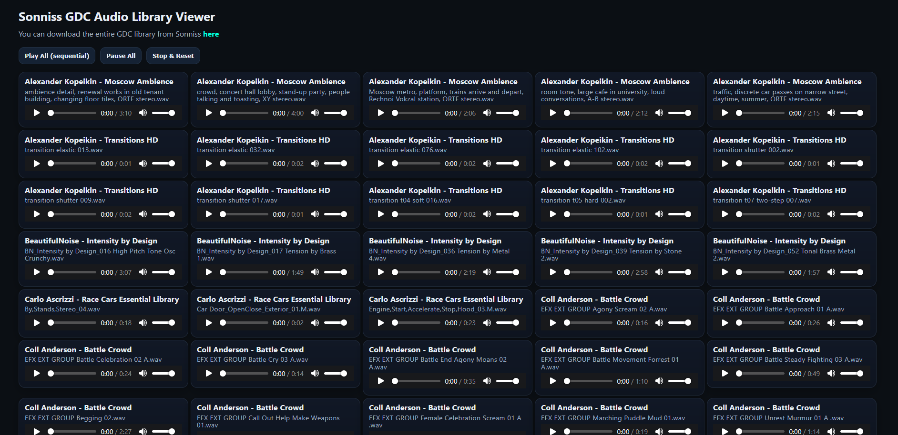
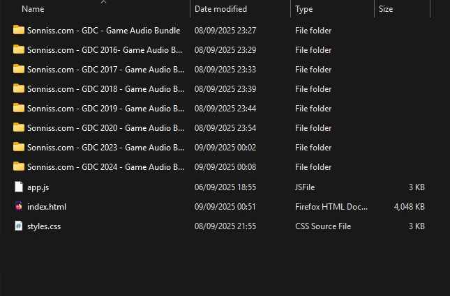

# sonniss-gdc-html-viewer
An HTML viewer I built for browsing through and listening to my collection of the Sonniss GDC audio archive

The viewer shows the audio file name and the folder it is contained in.
When you hover over the audio file name you can click on it and it will copy the path to the folder it is contained in.
You can then paste that to your file explorer or the explorer of the app you are editing in.

To make the viewer work, place the css, js and html files in the parent folder that contains the Sonniss GDC library.

To make the paths to the folders work on your system do a _find and replace_ in your text editor by opening the HTML file and finding "$" character then
replacing it with the path to the parent folder that contains all the main folders of the GDC audio library.

I have also included the Python file I used to create the HTML viewer if yould like to change anything or experiment with it to your liking, maybe even adapt it to
work with other sound files you may have collected or if you don't have the entire Sonniss GDC sound library.

Don't forget to change the _path_ variable on the Python file to your own parent folder path.

The text files named _wav_file_log.txt  and _found_duplicates.txt are the complete list of the Sonniss GDC sound library and a list of which files
occur more than once in the entire collection respectively.
